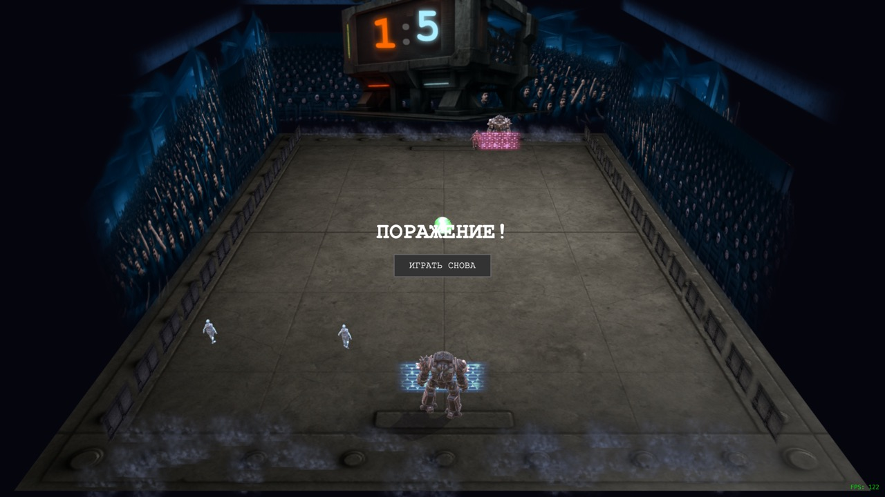

# Warpong 3D

> Multiplayer 3D pong with mechs, plasma & zombies. Babylon.js + Bun WebSocket.



## Features

- **Real-time 1v1 multiplayer** over WebSocket with server-authoritative physics
- **Solo mode** with AI opponent
- **ELO matchmaking** (K=32) with coin stake system
- **Upgrades** — paddle speed & size, ball speed, glow effect
- **Cosmetics** — paddle colors, ball trails
- **Zombie defense waves** — 3D zombies with animations and plasma burn effects
- **3D mechs** as player avatars with idle, strafe, and victory animations
- **Energy shields**, plasma orbs, and particle effects
- **Sound system** — dynamic battle music, hit/goal SFX, crowd ambience

## Tech Stack

| Layer | Technology |
|-------|-----------|
| Client | [Babylon.js](https://www.babylonjs.com/) 7, TypeScript, Vite |
| Server | [Bun](https://bun.sh/), WebSocket, SQLite (WAL mode) |
| Auth | Yandex Games SDK (HMAC-SHA256) |
| Linter | [Biome](https://biomejs.dev/) |

## Quick Start

### Prerequisites

- [Node.js](https://nodejs.org/) 18+ (client)
- [Bun](https://bun.sh/) (server)

### Setup

```bash
git clone https://github.com/litury/warpong-3d.git
cd warpong-3d
```

**Server:**

```bash
cd server
bun install
bun run dev          # starts on port 3030
```

**Client** (in a separate terminal):

```bash
cd client-babylon
npm install
npm run dev          # starts on port 5174
```

Open `http://localhost:5174` in your browser.

Or from the project root:

```bash
npm run dev:server   # server in watch mode
npm run dev:client   # client with HMR
```

### Environment Variables

| Variable | Default | Description |
|----------|---------|-------------|
| `YANDEX_GAMES_SECRET` | — | Yandex Games HMAC secret for auth verification |
| `WS_URL` | `ws://localhost:3030` | WebSocket server URL (client-side, Vite) |

## Project Structure

```
warpong-3d/
├── server/                # Bun WebSocket + HTTP server
│   └── src/
│       ├── index.ts       # Entry point, WS lifecycle
│       ├── catalog.ts     # Shop: upgrades & cosmetics
│       ├── config/        # Game physics constants
│       ├── handlers/      # WS message handlers
│       └── modules/
│           ├── auth/          # Yandex signature verification
│           ├── db/            # SQLite persistence
│           ├── gameSession/   # Match tick loop, scoring, ELO
│           └── matchmaking/   # FIFO queue, session lifecycle
│
├── client-babylon/        # Babylon.js 3D client
│   └── src/
│       ├── main.ts        # App init
│       ├── game/          # Scene, input, physics, models
│       ├── network/       # WebSocket client, server sync
│       └── config/        # Game physics constants
│
└── docs/                  # Screenshots
```

## Game Mechanics

| Parameter | Value |
|-----------|-------|
| Arena | 800 x 600 |
| Ball speed | 300 initial, +20/hit, 600 max |
| Paddle speed | 400 px/s |
| Win condition | First to 5 |
| Tick rate | 60/s |
| ELO | K=32, floor at 0 |
| Match stake | 10 coins, winner gets 18 (10% commission) |

## Scripts

| Command | Description |
|---------|-------------|
| `npm run dev:server` | Start server in watch mode |
| `npm run dev:client` | Start client dev server |
| `npm run typecheck` | TypeScript check (server + client) |
| `npm run lint` | Biome lint |
| `npm run format` | Biome format |
| `npm run check` | Biome lint + format check |

## Contributing

Contributions are welcome! Feel free to open issues and pull requests.

1. Fork the repository
2. Create your feature branch (`git checkout -b feature/amazing-feature`)
3. Commit your changes (`git commit -m 'feat: add amazing feature'`)
4. Push to the branch (`git push origin feature/amazing-feature`)
5. Open a Pull Request

## License

[MIT](LICENSE)
